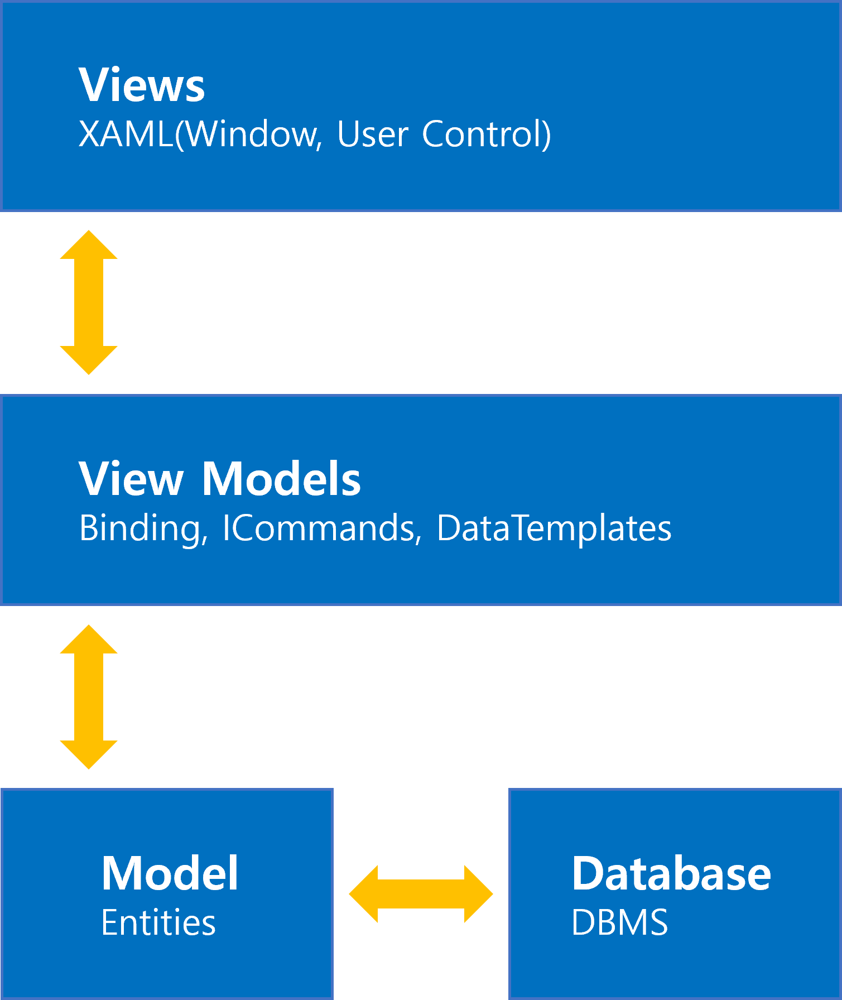

## 📕 프로젝트 개요(Introduce Project)

### WPF MVVM

* WPF MVVM 템플릿 프로젝트를 작성합니다.

## 💡 사용법(Tip)
 1. MVVM 구성을 위해 `Models` , `View`, `ViewModel` 폴더를 생성합니다. 
 2. View 구성 : [MainWindow.xaml](./WPF-MVVM/View/MainWindow.xaml), [MainWindow.xaml.cs](./WPF-MVVM/View/MainWindow.xaml.cs) 파일을 `View` 폴더로 이동합니다.
    * [App.xaml](./WPF-MVVM/App.xaml)의 `StartupUri` 속성을 "View/MainWindow.xaml" 로 수정합니다.
 3. ViewModel 구성 : `ViewModel` 폴더에 [AppViewModel.cs](./WPF-MVVM/ViewModel/AppViewModel.cs), [AppNotify.cs](./WPF-MVVM/ViewModel/AppNotify.cs) 파일을 생성하고  `Command` 폴더를 생성합니다.
 4. [비고](#MVVM-관계)와 같이 바인딩하여 `View(MainWindow)` 와 `ViewModel(AppViewModel)` 연결합니다.
 5. [AppNotify](#INotifyPropertyChanged)에 Binding에 이용할 속성(Property)를 정의합니다.
    * 값이 변경되면 OnPropertyChanged("PropertyPath")를 호출하며 이벤트를 발생시킵니다.
    * 바인딩 업데이트 조건에 이용됩니다.UpdateSourceTrigger = UpdateSourceTrigger.PropertyChanged
 6. Command를 이용하여 Button Click 이벤트를 대체합니다.
    * [AppCommand](./WPF-MVVM/ViewModel/Command/AppCommand.cs)를 템플릿으로 이용하여 활용합니다.
    * [ViewModel](./WPF-MVVM/ViewModel/AppViewModel.cs)에 [AppCommand](./WPF-MVVM/ViewModel/Command/AppCommand.cs) 타입의 속성을 정의합니다.
    * [ViewModel](./WPF-MVVM/ViewModel/AppViewModel.cs) 생성자에서 [AppCommand](./WPF-MVVM/ViewModel/Command/AppCommand.cs)를 초기화 합니다. 
        * `AppCmd = new AppCommand(Command가 호출되면 실행할 메서드)`
 7. Model 구성 : [Model](./WPF-MVVM/Models/Context.cs) (데이터베이스 접근 클래스)를 [ViewModel](./WPF-MVVM/ViewModel/AppViewModel.cs)에서 사용합니다.

## 💻 개발 환경(Develop Environment)

### 세부 환경(Environment Detail)

* ✔ OS : 
  * 🕒 Version : `10 Pro 21H2`
* ✔ Language : 
* ✔ Dependency : 
  * 🕒 Version : `6.0`

## 📖 비고(Remark)

### INotifyPropertyChanged

* 속성(`Property`)의 값 변경을 감지하여 이벤트를 발생시키는 역할입니다.
* `OnPropertyChanged(string Message)` 바인딩 시 `PropertyPath`로 이용됩니다.

### MVVM 관계

